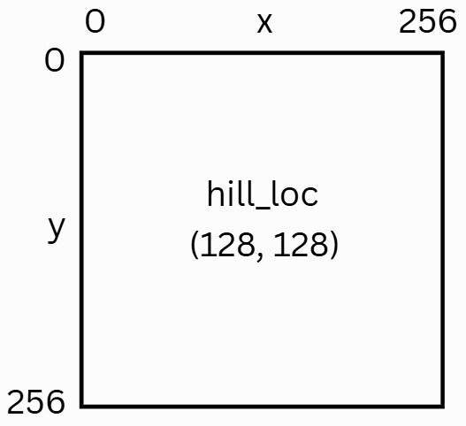
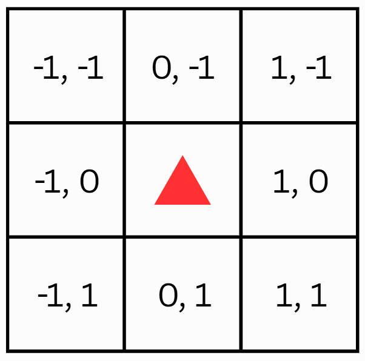
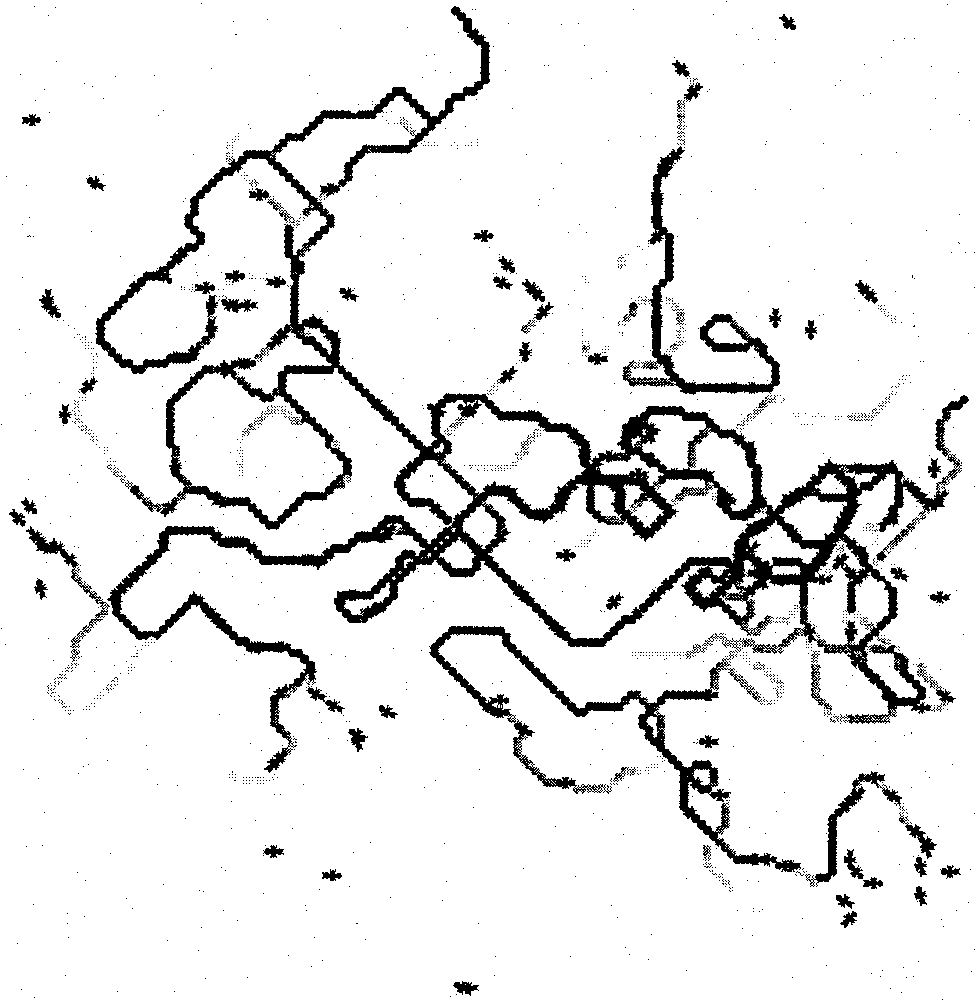
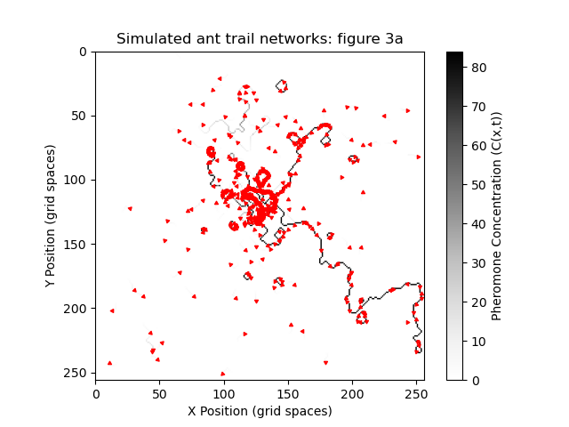
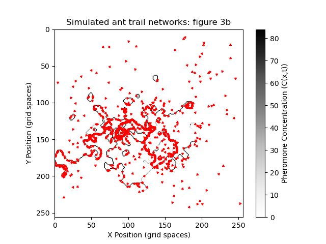

# Scientific Computing Project 1: Ants

This repository holds the code for the first project in ENGR3560: Scientific Computing. The goal is to replicate the cellular automata model used to simulate the formation of trails of foraging ants, as detailed in the paper 'Modelling the Formation of Trail Networks by Foraging Ants' (Watmough, Edelstein-Keshet), 1995. The specific deliverables are recreations of Figure 3 (a, b, c) from the paper. This paper acts as a baseline agent-based modeling tool, and has been a major influence in optimization, swarm robotics, and complex systems.

This is implemented in Python. Individual agents (ants) move on a Numpy Array (grid) and deposit pheromone as they move. Other ants can react to the pheromone levels and change their movement behavior from exploratory to following (a trail). The grid (and the ants) are visualized using MatPlotLib.

## Key Simulation Variables

`tau` - rate of pheromone deposition per ant per time step

`fidelity` - probability per iteration of an ant remaining on a trail with a local concentration of C

## Simulation Outputs

`F` - number of trail follower ants, across the full grid at the last timestep

`L` - number of exploratory (lost) ants, across the full grid at the last timestep

## Default Grid & Ant Rotation

Ants move one grid space per iteration. Each ant stores its current heading as an integer from 0 to 7, representing one of 8 possible movement directions. This direction is relative to the ant's current position, and is stored in the ant's `direction` attribute. 

| Direction | Meaning         | (dx, dy) |
| --------- | --------------- | -------- |
| 0         | Forward (Up)    | (0, -1)  |
| 1         | Forward-Right   | (1, -1)  |
| 2         | Right           | (1, 0)   |
| 3         | Back-Right      | (1, 1)   |
| 4         | Backward (Down) | (0, 1)   |
| 5         | Back-Left       | (-1, 1)  |
| 6         | Left            | (-1, 0)  |
| 7         | Forward-Left    | (-1, -1) |

In visualizations, ants are displayed as triangular markers pointing their current direction.


<table>
  <tr>
    <td align="center">
      <br>
      Default grid (256x256), 
    </td>
    <td align="center">
      <br>
      Numbered grid locations around ant
    </td>
    <td align="center">
      <br>
      Direction vectors for movement
    </td>
  </tr>
</table>

## Usage Examples & Benchmarks

Here is a comparison of the simulations this repo produces for figures 3a, b, c with the figures in the paper. In the current implementation, the simulated ant trails seem to curl more than the those in the reference figures. The reason behind this has not been fully explored and limits the use of this code. 

Constant parameters across all figures: `tau = 8, grid_size = 256, num_steps = 1500`

### Figure 3a (`fidelity: 255`)
<table>
  <tr>
    <td align="center">
      <br>
      Figure 3a from paper, page 361
    </td>
    <td align="center">
      <br>
      Simulated result, F = 1386, L = 114
    </td>
  </tr>
</table>


### Figure 3b (`fidelity: 251`)
<table>
  <tr>
    <td align="center">
      <br>
      Figure 3b from paper, page 361
    </td>
    <td align="center">
      <br>
      Simulated result, F = 1157, L = 343
    </td>
  </tr>
</table>

### Figure 3c (`fidelity: 247`)
<table>
  <tr>
    <td align="center">
      <br>
      Figure 3c from paper, page 362
    </td>
    <td align="center">
      <br>
      Simulated result, F = 1077, L = 423
    </td>
  </tr>
</table>

## Requirements

The `requirements.txt` file contains the required package imports:
- matplotlib~=3.7.2
- numpy~=1.24.3
- pytest~=7.4.0

## How to Use
1. Clone the repository:
```
git clone https://github.com/olincollege/scicomp-p1-alex_ants.git
cd scicomp-p1-alex_ants/
```

2. Install dependencies:
```
pip install -r requirements.txt
```

3. Run the simulation:
```
python main.py
```

## File Structure
ants.py - Contains Ant class and all helper functions, including explorer/follower decision making.

constants.py - Contains global variables constant across all files in ants simulation.

grid.py - Contains Grid class and all helper functions.

main.py - Main python file from which to run the code.

simulation_run.py - Contains simulation function. To be run in main.py.

simulation_setup.py - Contains simulation step function for ant trial modeling: movement, pheromones, population updates. 

visualize.py - Contains visualization functions.

test_ants.py - Tests relevant functions in ants.py.

test_grid.py - Tests relevant functions in grid.py.


## Author
The creator of this repository is Alex Mineeva (amineeva).


## Sources
James Watmough, Leah Edelstein-Keshet,
Modelling the Formation of Trail Networks by Foraging Ants,
Journal of Theoretical Biology,
Volume 176, Issue 3,
1995,
Pages 357-371,
ISSN 0022-5193,
https://doi.org/10.1006/jtbi.1995.0205.
(https://www.sciencedirect.com/science/article/pii/S0022519385702056)
Abstract: This paper studies the role of chemical communication in the formation of trail networks by foraging ants. A cellular automaton model for the motion of the ants is formulated, which assumes that individuals interact according to a simple behavioural algorithm. The ants communicate by depositing trail markers composed of volatile chemicals that serve as attractants for other ants. The ants interact with the network both by following the trails and by extending and reinforcing the trails they follow. By varying the parameters describing these interactions we determine how variations in the behaviour of the individual ants lead to changes in the patterns of trail networks formed by the population. The results indicate that the ability of the group to form trails is inversely related with individual fidelity to trails.